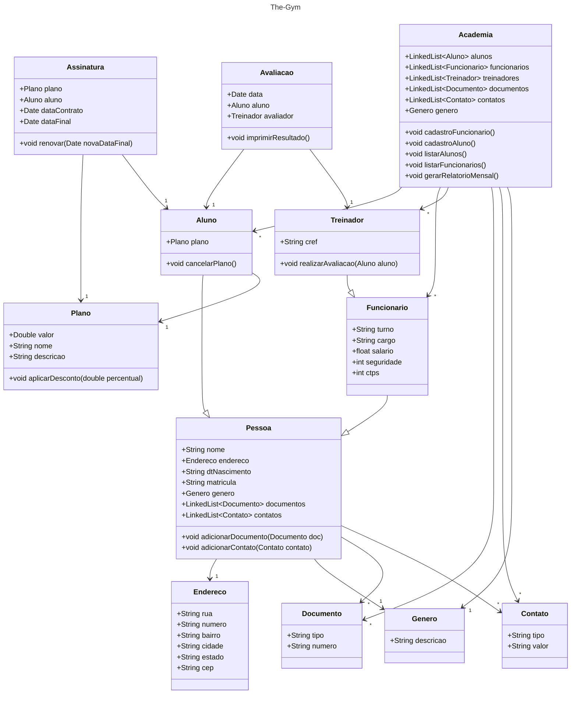

```mermaid
---
title: The-Gym
---
classDiagram

    Funcionario --|> Pessoa
    Aluno --|> Pessoa
    Treinador --|> Funcionario

    Pessoa --> "1" Endereco
    Pessoa --> "1" Genero
    Pessoa --> "*" Documento
    Pessoa --> "*" Contato

    Aluno --> "1" Plano
    Assinatura --> "1" Plano
    Assinatura --> "1" Aluno

    Avaliacao --> "1" Aluno
    Avaliacao --> "1" Treinador

    Academia --> "*" Aluno
    Academia --> "*" Funcionario
    Academia --> "*" Treinador
    Academia --> "*" Documento
    Academia --> "*" Contato
    Academia --> "1" Genero

    class Pessoa {
        +String nome
        +Endereco endereco
        +String dtNascimento
        +String matricula
        +Genero genero
        +LinkedList~Documento~ documentos
        +LinkedList~Contato~ contatos
        +void adicionarDocumento(Documento doc)
        +void adicionarContato(Contato contato)
    }

    class Funcionario {
        +String turno
        +String cargo
        +float salario
        +int seguridade
        +int ctps
    }

    class Aluno {
        +Plano plano
        +void cancelarPlano()
    }

    class Treinador {
        +String cref
        +void realizarAvaliacao(Aluno aluno)
    }

    class Plano {
        +Double valor
        +String nome
        +String descricao
        +void aplicarDesconto(double percentual)
    }

    class Assinatura {
        +Plano plano
        +Aluno aluno
        +Date dataContrato
        +Date dataFinal
        +void renovar(Date novaDataFinal)
    }

    class Avaliacao {
        +Date data
        +Aluno aluno
        +Treinador avaliador
        +void imprimirResultado()
    }

    class Endereco {
        +String rua
        +String numero
        +String bairro
        +String cidade
        +String estado
        +String cep
    }

    class Genero {
        +String descricao
    }

    class Documento {
        +String tipo
        +String numero
    }

    class Contato {
        +String tipo
        +String valor
    }

    class Academia {
        +LinkedList~Aluno~ alunos
        +LinkedList~Funcionario~ funcionarios
        +LinkedList~Treinador~ treinadores
        +LinkedList~Documento~ documentos
        +LinkedList~Contato~ contatos
        +Genero genero

        +void cadastroFuncionario()
        +void cadastroAluno()
        +void listarAlunos()
        +void listarFuncionarios()
        +void gerarRelatorioMensal()
    }
```